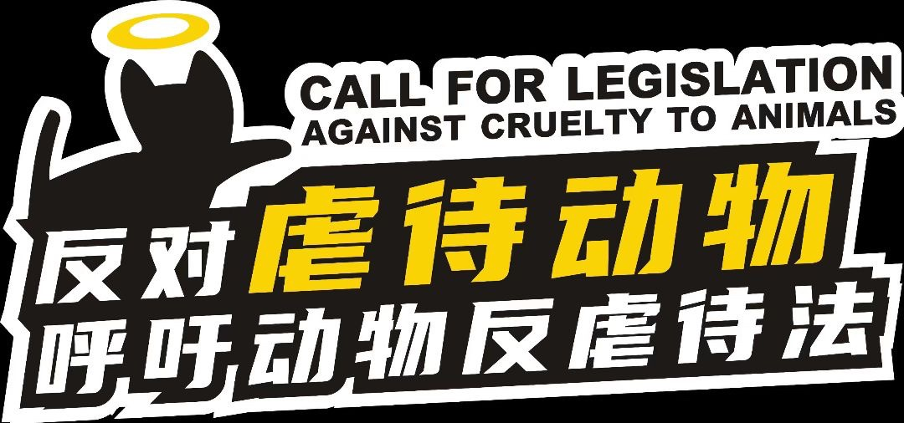

# Give the cuties a home 🐱🐶

## Our Goals

1. **To effectively stop the spread of "terrorist and violent messages" on the Internet in China by working with regulators, platforms and volunteers. **2. 
2. **Expedite the legislative process to lay a solid legal foundation to stop the spread of terrorist violence in society. ** 

## How can we effectively stop "animal cruelty"?

1. Report to the police: When faced with an animal abuse incident, you can call the local public security authorities and report the incident to them in a timely manner.
2. Report: You can report animal cruelty by visiting the official websites of relevant government departments.
3. Submit a complaint: You can call the local government department or fill out a complaint form through official channels to express your complaint about animal cruelty.
4. Seek help from public welfare organizations: When you feel powerless to deal with the situation alone, you can seek help from national public security authorities, animal protection associations or social welfare organizations.
5. upload evidence: if the situation allows, try to record the animal abuse and then upload it to social media platforms so that more people can understand and take action;
6. raise public awareness: without revealing the specifics of animal abuse, post advocacy messages against animal cruelty in the community as a way to draw the attention of the community and prompt the authorities to take action;
7. contacting us: for non-sensitive content, you are welcome to submit ISUES on our website, for sensitive content, please encrypt it first and then send it to admin@cats.pm to prevent secondary dissemination of harmful information;

